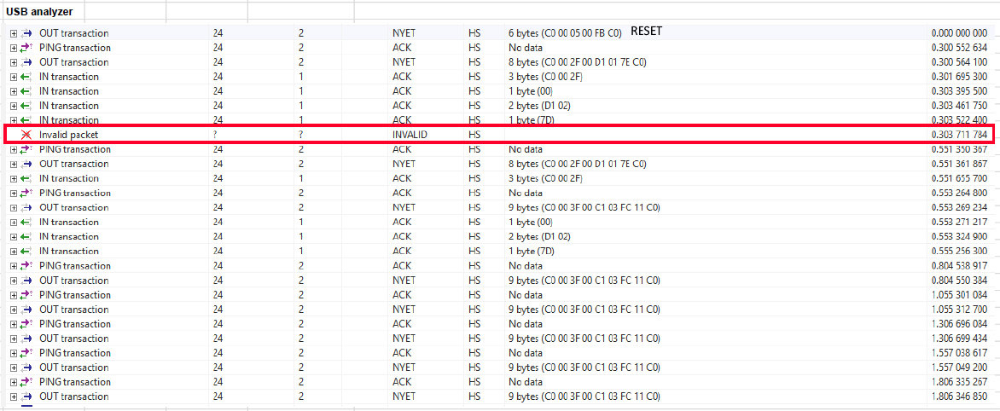
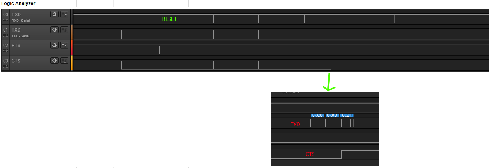

# Known Issues

## Windows Issues

#### /dev/null git apply issue

`Git` >= 2.19.0 is required to solve this issue.

#### CreateProcess issue

```
echo  Makefile
CreateProcess(NULL,echo Makefile,...)
process_begin: CreateProcess(NULL, echo Makefile, ...) failed.
Putting child 01DD8B10 (_build) PID 31536216 on the chain.
Live child 01DD8B10 (_build) PID 31536216
make (e=2): The system cannot find the file specified.
Reaping losing child 01DD8B10 PID 31536216
make: *** [Makefile:323: _build] Error 2
Removing child 01DD8B10 PID 31536216 from chain.
```

This issue is due to missing `sh` or `bash` in path.
Adding `sh` or `bash` will fix the issue.

#### Long paths issue

```
Compiling file: ble_gap_evt_conn.c
../../../../../../components/serialization/connectivity/codecs/ble/serializers/ble_gap_evt_conn.c:46:10: fatal error: conn_ble_gap_sec_keys.h: No such file or directory
#include "conn_ble_gap_sec_keys.h"
^~~~~~~~~~~~~~~~~~~~~~~~~
compilation terminated.
make: *** [../../../../../../components/toolchain/gcc/Makefile.common:272:
```

In the Windows API (with some exceptions discussed in the following paragraphs), the maximum length for a path is MAX_PATH, which is defined as 260 characters. If the path length exceeds MAX_PATH, then it will have this issue.
[See more details here](https://docs.microsoft.com/en-us/windows/desktop/fileio/naming-a-file#paths)


---
## macOS Issues

#### Timeout error related to the SEGGER J-Link firmware

On macOS (OS X) there is a known issue with the SEGGER J-Link firmware (that runs on the Debug probe on the board) related to USB packet sizes. This results in the timeout error `Failed to open nRF BLE Driver. Error code: 0x0D` when the serial port is attempted to be opened.

There are two ways to solve this issue:

1. Use the SEGGER firmware, but disable the Mass Storage Device (MSD) feature. Instructions are available [here](https://wiki.segger.com/index.php?title=J-Link-OB_SAM3U).

2. Replace the firmware on the Debug probe with the mbed DAPLink firmware:
    - Enter bootloader mode by powering off the nRF5 Development Kit and then pressing IF BOOT/RESET while you power on the kit.
    - Drag and drop the [nrf5x_osx_fix.bin](https://github.com/NordicSemiconductor/pc-ble-driver/blob/master/tools/nrf5x_osx_fix.bin) file into the BOOTLOADER mass storage device.

If you want to revert back to the SEGGER firmware you will have to download the it from [this location](http://www.nordicsemi.com/eng/nordic/Products/nRF51-DK/nRF5x-OB-JLink-IF/52276)


---
## SEGGER Issues

#### Data corruption or drops

Due to a known issue in Segger’s J-Link firmware, depending on your operating system and version you might experience data corruption or drops if you use the USB CDC ACM Serial Port with packets larger than 64 bytes. This has been observed on both GNU/Linux and macOS (OS X).

To avoid this, you can simply disable the Mass Storage Device by opening:

On GNU/Linux or macOS (OS X) JLinkExe from a terminal
On Microsoft Windows the “JLink Commander” application
And then typing the following:

```bash
MSDDisable
```

#### SEGGER OB sends invalid packet

1. SEGGER OB does not send two packet terminations (0xC0) from UART to USB host. SEGGER OB does not send 0xC0,0x00 from UART to USB host.

2. After d1 02 7d is received no more data is received in PC application, CTS is kept high. Assuming this is a side-effect of 1)



